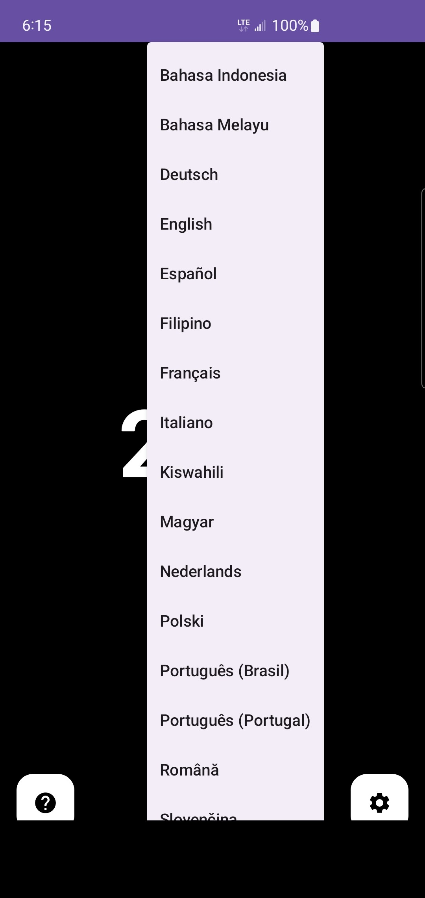
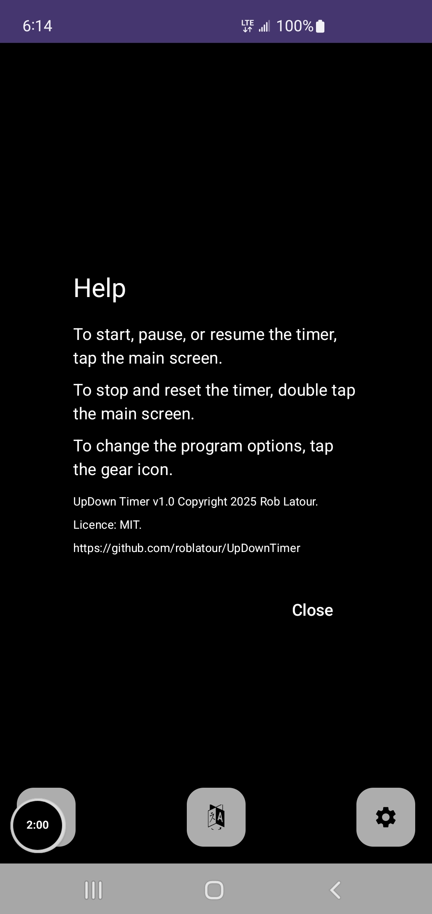
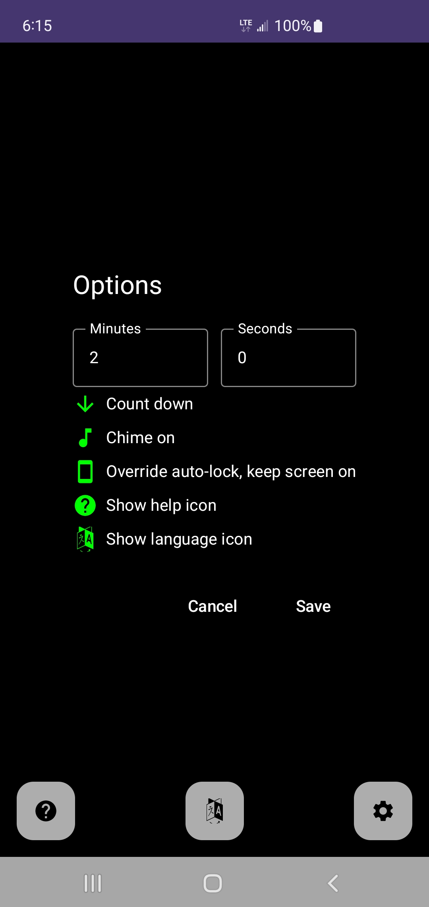
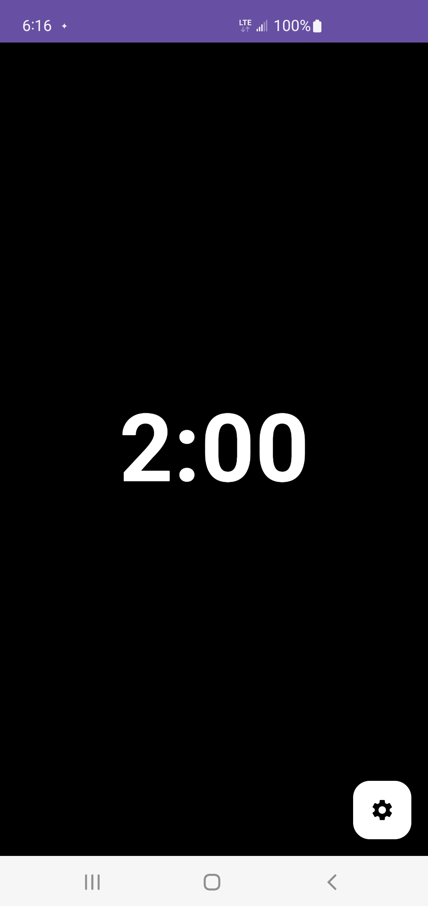

# Yet Another Timer v1.0 (for Android) - 2025-10-16

Open source timer for Android

# Background

I made this app for my own personal use - using it at the gym to count down rest periods between reps.  However, after it was done I thought it would be a good idea to make a few enhancements so that I could share it - like adding in support for different languages.

In any case, your welcome to use it for anything you like and/or to learn about Android code development.  

Also, I am currently going through the process of making this app available on the Google Play Store.  When that completes (likely around the start of November 2025) I will update this document with a link.

Finally, to give credit where credit is due, most of the coding for this project was done by the Copilot AI. I had to step in from time to time to get things working but Copilot did all of the heavy lifting - so cool.  

# App Features

- Simple one touch use
- Timer can be set to count up or down
- Optional chime when the timer hits a target
- Option lock screen override so screen doesn't go blank while the app is active
- Auto rotating screen
- 41 languages are supported (English is the default)
  -  Arabic, Bengali, Burmese (Myanmar), Chinese (Simplified), Chinese (Traditional), Czech, Dutch, **English**, Filipino (Tagalog), French, German, Greek, Gujarati, Hebrew, Hindi, Hungarian, Indonesian, Italian, Japanese, Kannada, Korean, Malay, Malay (Jawi script), Marathi, Persian (Farsi), Polish, Punjabi, Portuguese (Brazil), Portuguese (Portugal), Romanian, Russian, Slovak, Spanish, Swahili, Tamil, Telugu, Thai, Turkish, Ukrainian, Urdu, and Vietnamese.
 
# Screenshots

Below are some screenshots from the app. Thumbnails link to the full-size images stored in the `screenshots/` folder.

   
  

  
  

# Build and install

There are separate build and install instructions in this repository.

The build lets you build the .apk file from the source provided.

Install instructions allow you to install the program from your own build .apk file, or the one already included in this repository. The install can be either via an USB connection between your cell phone and W11, or via a download from this repository.

* * *
 # Support Yet Another Timer

 To help support Yet Another Timer, or to just say thanks, you're welcome to 'buy me a coffee'  

* * *
Copyright © 2025, Rob Latour
* * *

 

